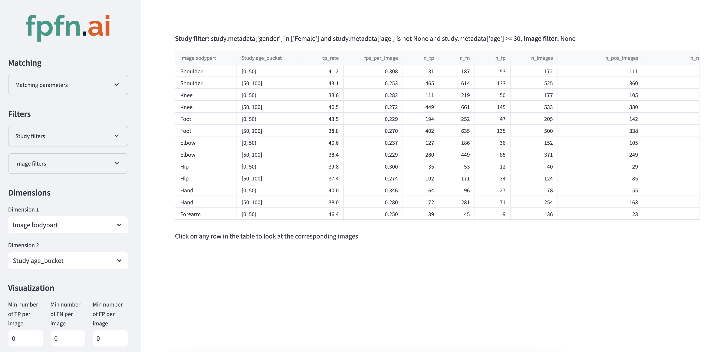

# README

## Overview

FPFN is a tool for getting performance insights of computer vision models. The goal is to make it much easier and faster to improve computer vision models and to empower more people to help out with data science work.

The user can instantly filter the dataset and see performance for any slice of the dataset. Up to two dimensions can be used at once to compare performance between different slices (see picture above). When clicking on a row in the table, FPFN will show the associated images with ground truth and detection bounding boxes overlayed. It is then possible to filter for images with at least X FP, FN or TP respectively.

## Starting the app

The installation instructions assume that you have conda installed (e.g. miniconda). You can install without conda by manually installing packages according to the contents of environment.yml

Perform the following steps to start the web app using a mock fracture detection dataset (recommended for first tests):

1. Clone this repository
2. `conda env create -f environment.yml`
3. `conda activate fpfn_env`
4. Manually copy the folder "test_data_images" from Google Drive (ask the owner of this repository for access) to the root of this repository folder.
5. Start the backend: `uvicorn api:app --reload`
6. Open a new terminal, activate the fpfn_env environment there also and start the frontend: `streamlit run frontend.py`
7. The first time the frontend is started it takes a few seconds until the GUI loads

### Configure the app to use a custom COCO dataset

- Open "api.py" and update the first lines of the file:
    1. Set the variable "load_custom_dataset" to True
    2. In the function call to "load_studydataset_from_coco", point to your COCO json files - one for ground truth and one for predictions
    3. In the same function call, also describe what your "study id" field is called and which metadata you want the tool to read for studies and images separately. The tool will automatically identify string, integer and float data types. It also handles None values (coded as _null_ in the json file).
    - Note: Image ids and study ids can be either int or str.
